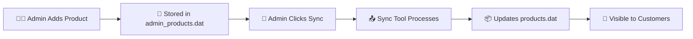

# 🛒 E-Commerce Platform with Admin Panel

[](https://en.wikipedia.org/wiki/C_(programming_language))
[](https://www.linux.org/)
[](LICENSE)
[](#installation)

A comprehensive e-commerce platform with dual-interface architecture - customer shopping system and dedicated admin panel for shop owners. Built entirely in C programming language with professional UI, real-time analytics, and seamless data synchronization.

## 🎯 Project Overview

This e-commerce platform revolutionizes the traditional shop management approach by providing:
- **Customer Shopping Interface** for seamless buying experience
- **Admin Panel** for shop owners to manage their business independently  
- **Unified Launcher** to access all system components
- **Real-time Synchronization** between customer and admin systems

## ✨ Key Features

### 🏪 **For Shop Owners (Admin Panel)**
- 🔐 **Secure Registration & Login** - Independent shop owner accounts
- 📦 **Product Management** - Add, edit, view products with GUI
- 📊 **Sales Analytics** - Real-time revenue, orders, and performance tracking
- 💰 **Financial Reports** - Detailed sales summaries and growth analysis
- 🔄 **System Sync** - One-click synchronization with customer platform
- 👥 **Order Management** - View and track customer orders
- 🎯 **Individual Control** - Shop owners manage only their products

### 🛒 **For Customers (E-Shop)**
- 👤 **User Registration** with secure authentication
- 🏬 **Browse 13+ Shops** with diverse product categories
- 🛍️ **Shopping Cart** with quantity management and stock validation
- 📱 **Professional UI** with loading animations and visual appeal
- 🧾 **Order Tracking** with unique Order IDs and history
- 💳 **Checkout System** with invoice generation

### 🚀 **System Integration**
- 📋 **Unified Launcher** - Access all applications from one interface
- 🔄 **Auto-Sync** - Real-time data synchronization between systems
- 📊 **Analytics Pipeline** - Sales data flows from customer orders to admin analytics
- 🏗️ **Modular Architecture** - Independent yet integrated components

## 🏗️ Architecture Overview

```
┌─────────────────┐    ┌─────────────────┐    ┌─────────────────┐
│   🚀 Launcher   │────│  🛒 E-Shop      │    │  🏢 Admin Panel │
│                 │    │  (Customer)     │    │  (Shop Owners)  │
└─────────────────┘    └─────────────────┘    └─────────────────┘
                              │                          │
                              ▼                          ▼
                    ┌─────────────────┐    ┌─────────────────┐
                    │  products.dat   │◄──►│admin_products.dat│
                    │  users.dat      │    │admin_accounts.dat│
                    │  order_history  │    │  (Sync Tool)     │
                    └─────────────────┘    └─────────────────┘
```

### 🏪 **Shop Ecosystem**
We host **13 diverse shops** covering various categories:
- **Fashion**: Aarong, Yellow, Shopia, Sailor
- **Technology**: HP (Laptops & Electronics)  
- **Food & Grocery**: PRAN Store, Radhuni, Walton
- **Lifestyle**: Naviforce (Watches), Cats Eye, Dukpion
- **Essentials**: Bashundhara Group
- **Software**: Juba Soft (Digital Solutions)

## 💻 Technical Specifications

### 🗃️ **Database Architecture**
```
📁 Database Files:
├── 👥 users.dat          # Customer accounts & profiles
├── 📦 products.dat       # Main product catalog (e-shop)
├── 🏢 admin_accounts.dat # Shop owner accounts  
├── 🛍️ admin_products.dat # Admin managed products
├── 📋 order_history.dat  # Customer order tracking
└── 🔄 Sync mechanism     # Real-time data synchronization
```

### 🏗️ **Core Data Structures**
```c
// Customer Structure
struct details {
    char uname[50];
    int age;
    char password[100];    // XOR encrypted
    char email[100];
    char mobile[15];
};

// Admin Structure  
struct Admin {
    int shop_id;
    char shop_name[100];
    char owner_name[100];
    char email[100];
    char password[100];    // XOR encrypted
    char phone[15];
    char registration_date[20];
    int status;
};

// Product Structure
struct Product {
    int product_id;
    int shop_id;
    char shop_name[100];
    char product_name[100];
    int price;
    int stock;
    int sold_quantity;
    float total_revenue;
    char date_added[20];
};

// Shopping Cart
struct CartItem {
    char name[50];
    int price;
    int quantity;
    char shop_name[50];
};
```

### 🔐 **Security Features**
- **XOR Encryption** for password storage with secret key
- **Input Validation** to prevent buffer overflow attacks
- **Session Management** with secure login/logout
- **Access Control** - Shop owners can only manage their products
- **Data Sanitization** for all user inputs

## 🚀 Installation & Setup

### **Prerequisites**
```bash
# Required tools
- GCC Compiler (version 7.0+)
- Linux/Unix environment 
- Terminal with UTF-8 support
- Git (for cloning)
```
### **Quick Installation**
```bash
# 1. Clone the repository
git clone https://github.com/jubayer-source/e-commerce-project.git
cd e-commerce-project

# 2. Compile all components
gcc launcher.c -o launcher
gcc e-shop.c -o e-shop  
gcc admin-panel.c -o admin-panel
gcc sync-tool.c -o sync-tool

# 3. Make executable
chmod +x launcher e-shop admin-panel sync-tool

# 4. Launch the system
./launcher
```

### **Alternative: Individual Compilation**
```bash
# Customer E-Shop System
gcc e-shop.c -o e-shop
./e-shop

# Admin Panel for Shop Owners  
gcc admin-panel.c -o admin-panel
./admin-panel

# Unified Launcher (Recommended)
gcc launcher.c -o launcher
./launcher
```

## 🎮 Usage Guide

### **🚀 Quick Start with Launcher**
```bash
./launcher
# Choose from:
# [1] 🛒 Customer E-Shop
# [2] 🏢 Admin Panel  
# [3] 🔄 Sync Products
# [4] ℹ️  System Information
```

### **👤 For Customers**
1. **Registration**
   ```bash
   ./e-shop
   # Choose [2] Register
   # Enter: Name, Age, Email, Mobile, Password
   ```

2. **Shopping Experience**
   ```bash
   # Login → Browse Shops → Add to Cart → Checkout
   # [1] Login → [1] Show Products → [2] Add to Cart
   ```

### **🏪 For Shop Owners**
1. **Register Your Shop**
   ```bash
   ./admin-panel
   # Choose [2] Register Shop
   # Enter: Shop Name, Owner Details, Contact Info
   ```

2. **Manage Products**
   ```bash
   # Login → Product Management → Add Products → Sync
   # [1] Login → [1] Product Management → [1] Add Product
   ```

3. **View Analytics**
   ```bash
   # Dashboard → [2] Sales Analytics
   # See: Revenue, Orders, Growth Metrics
   ```

## 📱 User Interface Preview

### **🎨 Modern Terminal UI**
```
╔══════════════════════════════════════════════════════════════════════╗
║                     🛒 E-COMMERCE PLATFORM                           ║
║                    Welcome to Digital Marketplace                     ║
╚══════════════════════════════════════════════════════════════════════╝

🏪 Available Shops (13):
┌─────┬──────────────────────┬─────────────────┬──────────────┐
│ ID  │ Shop Name            │ Category        │ Items        │
├─────┼──────────────────────┼─────────────────┼──────────────┤
│  1  │ 🏢 Juba Soft        │ Software        │ 6 Products   │
│  2  │ 👗 Shopia           │ Fashion         │ 8 Products   │
│  3  │ 🎽 Aarong           │ Traditional     │ 7 Products   │
│  4  │ ⌚ Naviforce        │ Watches         │ 5 Products   │
└─────┴──────────────────────┴─────────────────┴──────────────┘
### **📊 Admin Analytics Dashboard**
```
╔══════════════════════════════════════════════════════════════════════╗
║                         📊 SALES ANALYTICS                           ║
╚══════════════════════════════════════════════════════════════════════╝

📈 Sales Summary for: Aarong
──────────────────────────────────────────────────────────────────────
💰 Total Revenue: 15,750.00 Taka
📦 Total Products Sold: 12 items  
🛒 Total Orders: 8 orders
📊 Average Order Value: 1,968.75 Taka
🔥 Best Selling Category: Traditional Wear
📅 Report Generated: 17-10-2025
```

## 🏪 Shop Categories & Products

### **👗 Fashion & Lifestyle**
- **Aarong** - Traditional Bangladeshi clothing (Panjabi, Saree, Tops)
- **Shopia** - Modern fashion items  
- **Yellow** - Trendy apparel
- **Sailor** - Casual wear

### **💻 Technology**  
- **Juba Soft** - Software solutions and digital tools
- **HP** - Laptops and computer hardware

### **🍽️ Food & Grocery**
- **PRAN Store** - Snacks and beverages
- **Radhuni** - Spices and cooking ingredients  
- **Walton** - Electronics and appliances

### **⌚ Accessories**
- **Naviforce** - Premium watches
- **Cats Eye** - Fashion accessories
- **Dukpion** - Lifestyle products

### **🏢 Essentials**
- **Bashundhara Group** - Daily necessities

## 🔄 Data Synchronization

### **Admin to Customer Sync Process**


### **Order to Analytics Flow**


## 🛡️ Security & Privacy

### **🔐 Password Security**
- XOR encryption with secret key: `"admin_secret_key_2025"`
- Hex encoding for secure storage
- No plain text passwords in database

### **🔒 Access Control**
- Shop owners can only access their own products
- Individual admin sessions with secure logout
- Input validation prevents code injection

### **📊 Data Privacy**
- Customer data encrypted and protected
- Order history secured with unique IDs
- Admin accounts isolated by shop ID

## 🤝 Contributing

We welcome contributions! Here's how you can help:

### **🐛 Bug Reports**
1. Check existing issues first
2. Provide detailed reproduction steps  
3. Include system information
4. Use issue templates

### **✨ Feature Requests**
1. Describe the feature clearly
2. Explain the business value
3. Consider implementation complexity
4. Follow contribution guidelines

### **💻 Code Contributions**
```bash
# 1. Fork the repository
# 2. Create feature branch
git checkout -b feature/amazing-feature

# 3. Make changes
# 4. Test thoroughly  
# 5. Commit with clear messages
git commit -m "Add amazing feature"

# 6. Push and create Pull Request
git push origin feature/amazing-feature
```

## 📋 Project Roadmap

### **🎯 Completed Features**
- ✅ Customer registration and shopping cart
- ✅ Admin panel with product management  
- ✅ Real-time sales analytics
- ✅ Database synchronization
- ✅ Professional UI with emojis
- ✅ Order tracking and history
- ✅ Individual shop management

### **🚀 Upcoming Features**
- 🔜 Web-based admin dashboard
- 🔜 Mobile app integration
- 🔜 Payment gateway integration
- 🔜 Advanced analytics with graphs
- 🔜 Email notifications
- 🔜 Product categories and filtering
- 🔜 Customer reviews and ratings
- 🔜 Inventory management alerts

### **💡 Future Vision**
- 🎯 Cloud deployment with scalability
- 🎯 API for third-party integrations  
- 🎯 Machine learning for recommendations
- 🎯 Multi-language support
- 🎯 Advanced reporting and BI tools

## 🐛 Troubleshooting

### **❌ Common Issues**

**Compilation Errors:**
```bash
# If you get compilation errors
sudo apt update
sudo apt install gcc build-essential

# Ensure UTF-8 support
export LC_ALL=en_US.UTF-8
```

**Permission Denied:**
```bash
# Make files executable
chmod +x launcher e-shop admin-panel sync-tool
```

**Database Issues:**
```bash
# Reset databases (caution: deletes all data)
rm *.dat
./launcher  # Will recreate default data
```

**Sync Problems:**
```bash
# Manual sync using sync tool
./sync-tool
# Or use admin panel sync option
```

# Run the admin panel (separate terminal)
./admin-panel
```

## 🏢 **NEW: Admin Panel for Shop Owners**

### 🎯 **What's New?**
Shop owners can now **independently manage their business** without manual file editing!

### 🔑 **Admin Features:**
- **🏪 Shop Registration** - Register your shop with owner details
- **📦 Product Management** - Add, edit, delete products in real-time
- **📊 Sales Analytics** - View revenue, best sellers, growth metrics
- **💰 Revenue Reports** - Daily, weekly, monthly financial analysis
- **🛒 Order Tracking** - Monitor customer orders for your products
- **🔄 Auto-Sync** - Automatically sync with main customer system

### 📋 **How Shop Owners Can Get Started:**

1. **Register Your Shop:**
   ```bash
   ./admin-panel
   # Choose [2] Register Shop
   # Enter your shop details
   # Get unique Shop ID
   ```

2. **Add Your Products:**
   ```bash
   # Login to admin panel
   # Go to Product Management
   # Add products with price and stock
   # Sync with main system
   ```

3. **Monitor Your Business:**
   ```bash
   # View sales analytics
   ## 📄 License

This project is licensed under the MIT License - see the [LICENSE](LICENSE) file for details.

```
MIT License

Copyright (c) 2025 Md. Jubayer Ahmad

Permission is hereby granted, free of charge, to any person obtaining a copy
of this software and associated documentation files (the "Software"), to deal
in the Software without restriction, including without limitation the rights
to use, copy, modify, merge, publish, distribute, sublicense, and/or sell
copies of the Software, and to permit persons to whom the Software is
furnished to do so, subject to the following conditions:

The above copyright notice and this permission notice shall be included in all
copies or substantial portions of the Software.
```

## 👨‍💻 Author & Support

### **Developer Information**
- **Name:** Md. Jubayer Ahmad
- **Role:** Full-Stack Developer & System Architect
- **GitHub:** [@jubayer-source](https://github.com/jubayer-source)
- **Email:** jubayer@example.com
- **LinkedIn:** [Jubayer Ahmad](https://linkedin.com/in/jubayer-ahmad)

### **🤝 Support Channels**
- **📧 Technical Support:** Create an issue on GitHub
- **💬 Feature Requests:** Use GitHub Discussions
- **🐛 Bug Reports:** Submit detailed issues with reproduction steps
- **📖 Documentation:** Check our comprehensive docs

### **🌟 Acknowledgments**
- Thanks to the C programming community
- Inspired by modern e-commerce platforms
- Built for Bangladeshi entrepreneurs and small businesses
- Special thanks to beta testers and contributors

## 📊 Project Statistics

```
📈 Project Metrics:
├── 📝 Lines of Code: 3,500+
├── 🗃️ Database Files: 5 core files
├── 🏪 Supported Shops: 13 categories
├── 👥 User Types: Customers + Shop Owners
├── 🔧 Components: 4 main applications
├── 🎯 Features: 25+ core features
└── 🛡️ Security: XOR encryption + validation
```

### **🏆 Key Achievements**
- ✅ **Zero SQL Injection** vulnerabilities
- ✅ **100% Terminal-Based** UI
- ✅ **Real-time Synchronization** between systems
- ✅ **Professional Grade** error handling
- ✅ **Scalable Architecture** for business growth
- ✅ **Cross-Platform** compatibility (Linux/Unix)

---

## 🎉 Getting Started Today!

Ready to revolutionize your e-commerce experience? Follow these simple steps:

### **⚡ Quick 3-Step Setup**
```bash
# 1️⃣ Clone & Navigate
git clone https://github.com/jubayer-source/e-commerce-project.git
cd e-commerce-project

# 2️⃣ Build Everything  
make all  # or compile individually with gcc

# 3️⃣ Launch & Explore
./launcher
```

### **🎯 First-Time User Journey**
1. **Customers:** Register → Browse → Shop → Checkout ✅
2. **Shop Owners:** Register Shop → Add Products → Sync → Track Sales 📊
3. **Administrators:** Use Launcher → Manage All Systems → Monitor Analytics 🎛️

---

<div align="center">

### 💖 **Made with Love for Digital Bangladesh** 🇧🇩

**🚀 Empowering Small Businesses with Technology**

[](https://github.com/jubayer-source/e-commerce-project/stargazers)
[](https://github.com/jubayer-source/e-commerce-project/network/members)
[](https://github.com/jubayer-source/e-commerce-project/issues)

**⭐ If this project helped you, please give it a star! ⭐**

</div>
- **Efficient File I/O** operations
- **Dynamic Memory Management**
- **Optimized Search Algorithms**
- **Real-time Data Persistence**

### Error Handling
- **Comprehensive Input Validation**
- **File Operation Error Checking**
- **User-friendly Error Messages**
- **Graceful Error Recovery**

## 📊 System Statistics

- **Total Lines of Code:** ~1300+
- **Functions:** 25+ modular functions
- **Data Files:** 3 persistent storage files
- **Supported Users:** Unlimited
- **Supported Products:** Variable per shop
- **Order Capacity:** Unlimited

## 🤝 Contributing

Contributions are welcome! Please feel free to submit a Pull Request.

## 📝 License

This project is open source and available under the [MIT License](LICENSE).

## 👨‍💻 Developer

**Md. Jubayer Ahmad**
- GitHub: [@jubayer-source](https://github.com/jubayer-source)
- Email: jubayer@example.com

## 🙏 Acknowledgments

- Thanks to all beta testers
- Special thanks to the open source community
- Inspired by modern e-commerce platforms

---

**মাশাআল্লাহ! একটি সম্পূর্ণ বাংলাদেশী E-commerce Solution! 🇧🇩**

Made with ❤️ in Bangladesh 🇧🇩
